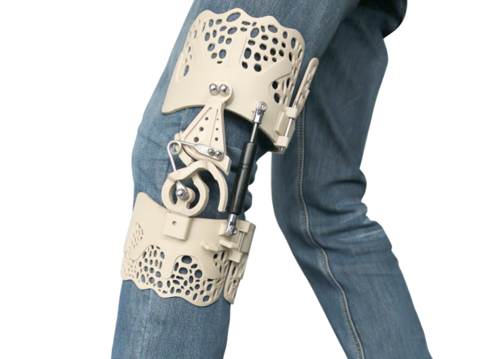
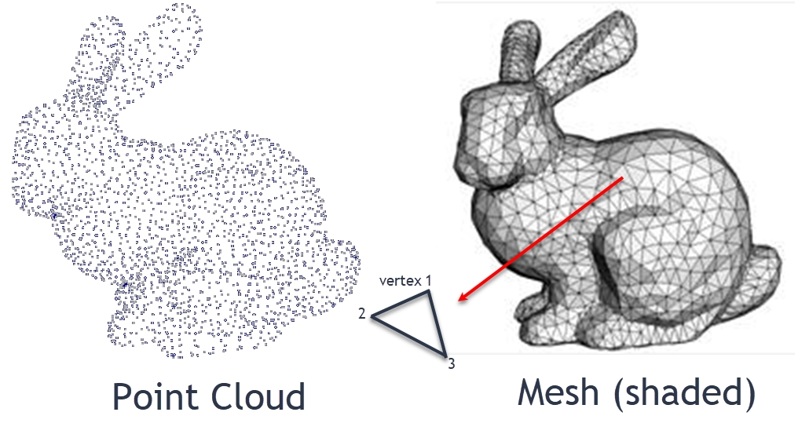

#HOW DOES 3D SCANNING WITH A CELL PHONE WORK?

##A Little Insight Into Photogrammetry

We are all different, so some things do not always fit perfectly. This is not only a problem when buying clothes but also in medicine, imagine you could make a 3D scan of yourself only with your cell phone and get an exactly fitting product that supports you in your treatment. The answer to this is called photogrammetry.[1]

To convert an object into a 3D model, images of the object are needed first. These should be very well and evenly illuminated and show the object from all sides with all details. In addition, every visible point should be recognizable on at least 2 images (more is more). The data obtained in this way can now be converted to a point cloud using various algorithms. Particularly prominent points of the images are used as landmarks to establish the connection between the different images.
This point cloud can then be converted to an STL file for economical reuse of the data.[2]

##Sources

1. [3D-gedruckte Knieorthese BioNEEK zur Verbesserung der Ausdauer und Beweglichkeit](https://3druck.com/medizin/3d-gedruckte-knieorthese-bioneek-zur-verbesserung-der-ausdauer-und-beweglichkeit-0570723/) Visited on:15.05.22
2. [3D-Modelle aus Fotos: Wie funktioniert digitale Photogrammetrie?](https://www.aspekteins.com/3d-modelle-aus-fotos-wie-funktioniert-digitale-photogrammetrie/) Visited on:15.05.22
